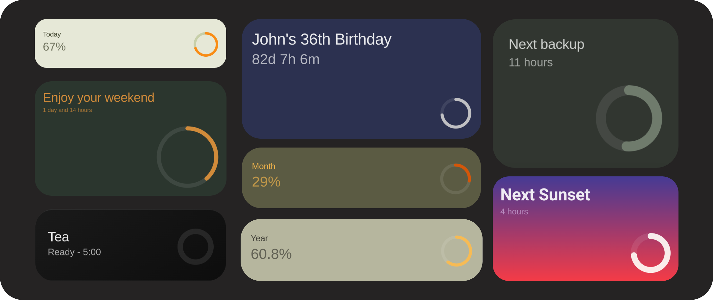
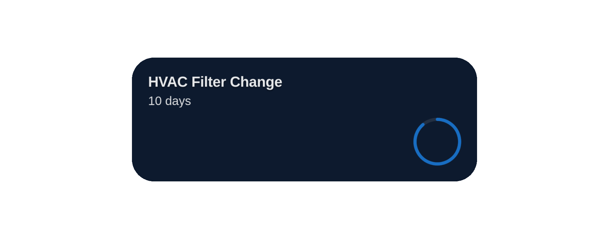

# TimeFlow Card


A beautiful, highly customizable countdown timer card for Home Assistant. Track your next trip, a loved one’s birthday, or an important deadline and always know exactly how much time is left. Now with built-in support for timers and Jinja2 templates.

[![Home Assistant][ha_badge]][ha_link] [![HACS][hacs_badge]][hacs_link] [![GitHub Release][release_badge]][release] [![Buy Me A Coffee][bmac_badge]][bmac]


## Table of contents

**[`Installation`](#installation)**  **[`Configuration`](#configuration)** **[`Examples`](#examples)** **[`Styling`](#styling)** **[`Templates`](#-template-support)** 
<br>

## Installation

#### HACS (Recommended)

<div align="left">
  <a href="https://my.home-assistant.io/redirect/hacs_repository/?owner=rishi8078&repository=Timeflow-card" target="_blank" rel="noopener noreferrer">
    
  </a>
</div>

####  Manual Installation

1.  Download `timeflow-card.js` from the latest [release](https://github.com/Rishi8078/TimeFlow-Card/releases).
2.  Copy the file to your `config/www/` directory.
3.  Add the card to your resources:
    ```yaml
    resources:
      - url: /local/timeflow-card.js
        type: module
    ```

## Configuration

This card offers a wide range of options to customize its appearance and behavior. You can find more details and the YAML in the documentation below.

| Option | Type | Default | Description |
| :-- | :-- | :-- | :-- |
| `target_date` | string | `null` | Countdown target. Can be ISO date string, Home Assistant entity ID, or a template. |
| `creation_date` | string | `null` | Start date for progress calculation. ISO date, entity ID, or template. |
| `creation_relative` | number | `null` | The number of seconds before the `target_date` that the progress circle should start. Use this relative value as an alternative to specifying a fixed `creation_date`. |
| `timer_entity` | string | `null` | Home Assistant `timer` entity. Overrides `target_date`. |
| `title` | string | `"Countdown Timer"` | Main title of the card. Supports templates. |
| `subtitle` | string | `null` | Subtitle for the card. Supports templates. |
| `expired_text` | string | `"Completed! 🎉"` | Text shown when countdown finishes. |
| `expired_animation` | boolean | `true` | Enables celebration animation when timer expires. |
| `show_months` | boolean | `true` | Show months unit. |
| `show_days` | boolean | `true` | Show days unit. |
| `show_hours` | boolean | `true` | Show hours unit. |
| `show_minutes` | boolean | `true` | Show minutes unit. |
| `show_seconds` | boolean | `true` | Show seconds unit. |
| `width` / `height` | string | `null` | Fixed card dimensions (e.g., `"200px"`, `"100%"`). |
| `aspect_ratio` | string | `"2/1"` | Aspect ratio for responsive sizing (e.g., `"1/1"`, `"16/9"`). |
| `color` | string | `"#FCFCFC"` | Primary text color. Supports templates. |
| `background_color` | string | `"#000001"` | Card background color. Supports templates. |
| `progress_color` | string | `"#C366CD"` | Progress bar color. Supports templates. |
| `icon_size` | string | `"100px"` | Progress circle size. Auto-scales by default. |
| `stroke_width` | number | `15` | Thickness of progress circle stroke. |
| `card_mod` | object | `null` | Advanced styling via [card-mod](https://github.com/thomasloven/lovelace-card-mod) integration. |


## Examples

### 🗓️ Daily Agenda Countdown


This is a smart "Daily agenda" card. It automatically updates to show you what's next on your calendar for the day and elegantly hides the countdown when there's nothing scheduled.

**Note:** Remember to replace `calendar.your_calendar_entity` with your own calendar entity ID.

<details>
<summary>View YAML</summary>

```yaml
type: custom:timeflow-card
title: >-
   
    {{ state_attr('calendar.your_calendar_entity', 'message') }}
  
    No Events Today
  
target_date: >-
   
    {{ event }}
  
    2000-01-01T00:00:00  # A past date to prevent the countdown
  
creation_date: "{{ now().replace(hour=0, minute=0, second=0, microsecond=0).isoformat() }}"
show_months: false
show_days: true
show_hours: true
show_minutes: true
show_seconds: false
background_color: "#075056"
color: "#E4EEF0"
progress_color: "#FF5B04"
expired_animation: false
expired_text: Enjoy Your Day!
stroke_width: 10
card_mod:
  style: |
    ha-card .title {
      font-size: 2.2rem;
    }
    ha-card .subtitle {
      font-size: 1.0rem;
    }
```
</details>

-----

### ☀️ Daily Progress Tracker


Track the current day. The progress circle fills up as the day goes on, and the subtitle dynamically displays the percentage of the day that has passed.

<details>
<summary>View YAML</summary>

```yaml
type: custom:timeflow-card
title: Today
subtitle: " {{ (now().hour / 24 * 100) | round() }}%"
target_date: >-
  {{ (now().replace(hour=23, minute=59,
  second=59)).strftime('%Y-%m-%dT%H:%M:%S') }}
creation_date: "{{ now().replace(hour=0, minute=0, second=0).strftime('%Y-%m-%dT%H:%M:%S') }}"
show_days: false
show_hours: true
show_minutes: true
show_seconds: true
aspect_ratio: 1/1
height: 180
icon_size: 60
color: "#424244"
background_color: "#FAFEFE"
progress_color: "#FB4E5B"
stroke_width: 6
card_mod:
  style:
    .: |
      ha-card .title {
        font-size: 1.2rem;
      }
      ha-card .subtitle {
        font-size: 2rem;
      }
    progress-circle$: |
      .progress-bg {
        stroke: #E5E6EA; /* Dark gray background track */
      }
```

</details>

-----

### 🎂 Dynamic Birthday Countdown


A fully automated birthday countdown. It calculates the person's upcoming age and even changes its color scheme based on the birth month. Simply fill in the name and birthdate in the designated `title`, `target_date`, and `color` sections to personalize it for anyone.

<details>
<summary>View YAML</summary>

**To customize for different people, you need to update the variables in three places:**

1.  **In the `title` section** - change these 4 variables:
    ```yaml
    
    
    
    
    ```
2.  **In the `target_date` section** - change these 2 variables:
    ```yaml
    
    
    ```
3.  **In the `color` section** - change these 2 variables:
    ```yaml
    
    
    ```
    


```yaml
type: custom:timeflow-card
title: >-
  
  
  
  
  
  
  
    
  
    
  
  
  {{ person_name }}'s {{ age }}{{ 
    'st' if age % 10 == 1 and age % 100 != 11 else
    'nd' if age % 10 == 2 and age % 100 != 12 else
    'rd' if age % 10 == 3 and age % 100 != 13 else
    'th'
  }} Birthday

target_date: >-
  
  
  
  
  
    
  
    
  
  {{ next_birthday.isoformat() }}

creation_date: >-
  
  
  {{ start_of_year.isoformat() }}

show_days: true
show_hours: true
show_minutes: true
show_seconds: false

color: >-
  
  
  
  
  
    
  
    
  
  
  
    #FF6B6B
  
    #4ECDC4
  
    #45B7D1
  
    #96CEB4
  

background_color: "#2C3150"
progress_color: "#D0CFCF"
aspect_ratio: 4/2
stroke_width: 6

card_mod:
  style: |
    ha-card .title {
      font-size: 2.2rem;
    }
    ha-card .subtitle {
      font-size: 2.0rem;
    }
```
</details>


-----

### 🌅 Automatic Sunrise & Sunset Card


A fully automatic countdown to the next sunrise or sunset. It dynamically changes its title and target based on the time of day.

<details>
<summary>View YAML</summary>

```yaml
type: custom:timeflow-card
title: "{{ ' Sunrise' if states('sun.sun') == 'below_horizon' else 'Next Sunset' }}"
target_date: >-
  {{ states('sensor.sun_next_rising') if states('sun.sun') == 'below_horizon'
  else states('sensor.sun_next_setting') }}
creation_date: |-
  
    {{ (states('sensor.sun_next_setting') | as_datetime).replace(day=(states('sensor.sun_next_setting') | as_datetime).day - 1).isoformat() }}
  
    {{ (states('sensor.sun_next_rising') | as_datetime).replace(day=(states('sensor.sun_next_rising') | as_datetime).day - 1).isoformat() }}
  
show_days: false
show_hours: true
show_minutes: false
show_seconds: false
icon_size: 100
aspect_ratio: 16/9
progress_color: "#FFFFFA"
card_mod:
  style: |
    ha-card {
      background-image: linear-gradient(to top, #f43b47 0%, #453a94 100%)!important;
      border-radius: 32px !important;
      box-shadow:
        0 8px 24px rgba(161, 140, 209, 0.4),
        inset 0 1px 0 rgba(255, 255, 255, 0.1) !important;
      transition: transform 0.2s ease-in-out;
    }
    ha-card .title {
      font-family: "SF Pro Text", -apple-system, BlinkMacSystemFont, "Segoe UI", Roboto, Helvetica, Arial, sans-serif;
      font-weight: 600;
      font-size: 3rem;
      color: #FFFFFF;

    }
    ha-card .subtitle {
      color: #D6B7E4; /* Soft complementary color */
      font-size: 1.5rem;
      font-weight: 400;
    }
```
</details>


-----

### 🛋️ Weekend Countdown


Automatically counts down to your weekend. During the week, it shows the time remaining until Friday at 6 PM. Once the weekend begins, it switches to count down to the start of the work week on Monday morning.

<details>
<summary>View YAML</summary>

```yaml
type: custom:timeflow-card
title: >-
   {{ 'Enjoy your weekend' if wd >= 5 else
  'Next Weekend Countdown' }}
target_date: |-
  
  
    {# Weekend - countdown to Monday 9 AM #}
    
    {{ (now() + timedelta(days=days_until_monday)).replace(hour=9, minute=0, second=0, microsecond=0).isoformat() }}
  
    {# Weekday - countdown to next Friday 6 PM #}
    
    {{ (now() + timedelta(days=days_until_friday)).replace(hour=18, minute=0, second=0, microsecond=0).isoformat() }}
  
creation_date: |-
  
  
    {# Weekend started Friday 6 PM #}
    
    {{ (now() - timedelta(days=days_since_friday)).replace(hour=18, minute=0, second=0, microsecond=0).isoformat() }}
  
    {# Weekday started Monday 9 AM #}
    
    {{ (now() - timedelta(days=days_since_monday)).replace(hour=9, minute=0, second=0, microsecond=0).isoformat() }}
  
show_days: true
show_hours: true
show_minutes: false
show_seconds: false
color: "#E3943B"
background_color: "#2B362E"
progress_color: "#E3943B"
show_progress_text: true
icon_size: 150
height: 280px
stroke_width: 10
card_mod:
  style: |
    ha-card .title {
      font-size: 2.2rem;
    }
    ha-card .subtitle {
      font-size: 1.0rem;
    }

```
</details>

-----

### 💾 Grid Layout with Multiple Timers


Use a `grid` card to display multiple countdowns side-by-side. This example shows a long-term travel countdown next to a dynamic countdown for the next scheduled backup.

**Note:** Remember to replace the `sensor.backup_...` entities with your own backup sensors.

<details>
<summary>View YAML</summary>

```yaml
square: false
type: grid
cards:
  - type: custom:timeflow-card
    title: Going Home
    target_date: "2025-09-12T13:43:50"
    background_color: "#1F033A"
    color: "#E1C5FC"
    progress_color: "#9C3DF5"
    show_seconds: false
    show_minutes: false
    show_hours: false
    show_days: true
    show_months: false
    creation_date: "2025-07-12T13:43:50"
    height: 180
    icon_size: 80
    card_mod:
      style:
        .: |
          ha-card .title {
            font-size: 1.2rem;
          }
          ha-card .subtitle {
            font-size: 1rem;
          }
        progress-circle$: |
          .progress-bg {
            stroke: #E5E6EA; /* Dark gray background track */
          }
  - type: custom:timeflow-card
    title: Next backup
    target_date: sensor.backup_next_scheduled_automatic_backup
    background_color: "#313630"
    color: "#DFE2DF"
    progress_color: "#768273"
    show_seconds: false
    show_minutes: false
    show_hours: true
    show_days: false
    show_months: false
    creation_date: sensor.backup_last_successful_automatic_backup
    card_mod:
      style: |
        ha-card .title {
          font-size: 1.2rem;
        }
        ha-card .subtitle {
          font-size: 1.0rem;
        }
    aspect_ratio: 1/1
    height: 180
    icon_size: 80
columns: 2

```
</details>

----

## Styling 

For full control over every element of the card, the [card-mod](https://github.com/thomasloven/lovelace-card-mod) integration is the recommended approach. It allows you to write custom CSS to override the default styles of the card and its sub-components.

### Card Elements

This table includes the primary structural elements you can target with CSS selectors like `card-mod`.

| Element | Selector | Example Customizations |
| :--- | :--- | :--- |
| **Card** | `ha-card` | Change the `background`, `border-radius`, or add a `box-shadow`. |
| **Card Content** | `.card-content` | Adjust `padding`, `background`, or control the flexbox layout (`justify-content`). |
| **Header** | `.header` | Modify `margin-bottom` or change the alignment of items within the header. |
| **Title Section** | `.title-section` | Add a `border` around the title/subtitle area or change its `gap`. |
| **Title** | `.title` | Adjust `font-size`, `color`, `font-weight`, and `line-height`. |
| **Subtitle**| `.subtitle` | Modify `font-size`, `color`, `opacity`, and `font-style` (e.g., italic). |
| **Content Area**| `.content` | Change the alignment (`align-items`, `justify-content`) of the progress circle area. |
| **Progress Section**| `.progress-section` | Adjust margins or positioning of the progress circle container. |
| **Progress Circle**| `.progress-circle` | Apply a `filter` like `drop-shadow` or adjust its `opacity`. |


> [!IMPORTANT]  
> Please note that you might have to add `!important;` to some CSS styles that are already defined (see examples below).
#### Examples

> [!NOTE]
> Click on the headings below to expand the code and see the examples.

<details>

<summary>Changing the font size of Title & Subtitle</summary>


<br>

```yaml
card_mod:
  style: |
    ha-card .title {
      font-size: 3rem;       
      font-weight: bold;
      line-height: 1.2;
    }
    ha-card .subtitle {
      font-size: 1.4rem;    
    }
```

</details>

<details>

<summary>Applying a gradient background with borders and shadows to a card </summary>


<br>

```yaml
card_mod:
  style: |
    ha-card {
      background-image: linear-gradient(to top, #f43b47 0%, #453a94 100%)!important;
      border-radius: 32px !important;
      box-shadow:
        0 8px 24px rgba(161, 140, 209, 0.4),
        inset 0 1px 0 rgba(255, 255, 255, 0.1) !important;
      transition: transform 0.2s ease-in-out;
    }
```
</details>

<details>

<summary>Changing the layout to side by side to create a more compact card</summary>


<br>

```yaml
card_mod:
  style: |
    .card-content {
      flex-direction: row !important;
      align-items: center !important;
      justify-content: space-between !important;
    }
    .header {
      margin-bottom: 0 !important;
    }
    .content {
      margin-top: 0 !important;
    }
```

</details>


<details>

<summary>Changing the background stroke color of a progress circle element for lighter color cards</summary>


<br>

```yaml
card_mod:
  style:
    .: |
    progress-circle$: |
      .progress-bg {
        stroke: #E5E6EA;
      }
```

</details>

<details>

<summary>Changing the background to an image</summary>


**Note**: To use your own image, replace `/local/study.gif` in the code below with the path to your image or gif file. Your image should be located in your Home Assistant's `config/www` directory.

<br>

```yaml
card_mod:
  style: |
    ha-card {
      position: relative;
      overflow: hidden;
      background-color: transparent !important;
    }
    ha-card::before {
      content: "";
      position: absolute;
      top: 0; right: 0; bottom: 0; left: 0;
      background: url("/local/study.gif") center/cover no-repeat;
      /* adjust the blur radius to taste */
      filter: blur(0.2px);
      /* scale up slightly so edges don’t show when blurred */
      transform: scale(1.1);
      z-index: 1;
    }
    ha-card::after {
      content: "";
      position: absolute;
      top: 0; right: 0; bottom: 0; left: 0;
      background-color: rgba(0,0,0,0.35);
      z-index: 2;
    }
```

</details>
<details>

<summary>Classic iPod vibes</summary>


<br>

```yaml
card_mod:
  style: |
    .title-section {
      background: rgba(0, 0, 0, 0.2);
      border-radius: 12px;
      padding: 40px;
      gap: 8px !important;
    }
```

</details>

## 📝 Template Support

Templates can be used in the following properties for dynamic content:

  - `title`
  - `subtitle`
  - `target_date`
  - `creation_date`
  - `color`
  - `background_color`
  - `progress_color`
  - `expired_text`

#### Example



A card to track the life of your HVAC filter. It dynamically changes its progress and background colors to give you a quick visual cue as the replacement date gets closer.

**Note**: Remember to create an `input_datetime` helper in Home Assistant to store your last filter change date and replace `input_datetime.last_hvac_filter_change` in the code with your own entity ID.

<details>

<summary>View YAML</summary>

```yaml
type: custom:timeflow-card
title: HVAC Filter Countdown
creation_date: "{{ states('input_datetime.last_hvac_filter_change') }}"
target_date: >-
  {{ (as_datetime(states('input_datetime.last_hvac_filter_change')) +
  timedelta(days=90)).isoformat() }}
color: "#FFFFFF"
progress_color: >-
   
  {{ '#D32F2F' if days_remaining <= 3 else '#F57C00' if days_remaining <= 7 else
  '#1976D2' }}
background_color: >-
   
  {{ '#2C1810' if days_remaining <= 3 else '#2D1F0A' if days_remaining <= 7 else
  '#0D1A2E' }}
show_days: true
show_hours: false
show_minutes: false
show_seconds: false
stroke_width: 1
expired_text: 🔧 Filter Change Due!
card_mod:
  style: |
    ha-card .title {
      font-size: 1.3rem;
      font-weight: bold;
      text-shadow: 0 1px 2px rgba(0,0,0,0.5);
    }
    ha-card .subtitle {
      opacity: 0.85;
      font-weight: 500;
    }

```
</details>

---
## 📄 License

MIT License - see the [LICENSE](https://www.google.com/search?q=LICENSE) file for details.

## ☕ Support Development

If you find this card useful, please consider supporting its development. Your contribution helps keep the project alive and growing.

<a href="https://coff.ee/rishi8078" target="_blank"></a>
-----

**TimeFlow Card - Made with ❤️ for the Home Assistant community**

<!-- Link references -->
[ha_badge]: https://img.shields.io/badge/Home%20Assistant-Compatible-green
[ha_link]: https://www.home-assistant.io/
[hacs_badge]: https://img.shields.io/badge/HACS-Compatible-orange
[hacs_link]: https://hacs.xyz/
[release_badge]: https://img.shields.io/github/v/release/Rishi8078/TimeFlow-Card
[release]: https://github.com/Rishi8078/TimeFlow-Card/releases
[bmac_badge]: https://img.shields.io/badge/buy_me_a-coffee-yellow
[bmac]: https://coff.ee/rishi8078
[Stars]:https://img.shields.io/github/stars/Rishi8078/TimeFlow-Card
[Last commit]:https://img.shields.io/github/last-commit/Rishi8078/TimeFlow-Card

