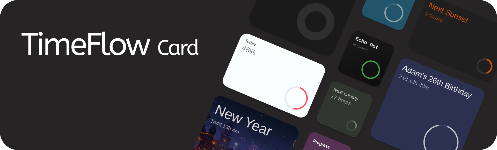

# TimeFlow Card



A beautiful, highly customizable countdown timer card for Home Assistant. Track your next trip, a loved one’s birthday, or an important deadline and always know exactly how much time is left. Now with built-in support for timers and Jinja2 templates.

[![Home Assistant][ha_badge]][ha_link] [![HACS][hacs_badge]][hacs_link] [![GitHub Release][release_badge]][release] [![Buy Me A Coffee][bmac_badge]][bmac]

Find a complete set of configuration examples in the [examples.md](https://github.com/Rishi8078/TimeFlow-Card/blob/main/examples.md) file.

## Table of contents

**[`Installation`](#️-installation)**  **[`Configuration`](#️-configuration)** **[`Examples`](#examples)** **[`Styling`](#️-advanced-styling-with-card-mod)** **[`Templates`](#-template-support)** 
<br>

## Installation

#### HACS (Recommended)

<div align="left">
  <a href="https://my.home-assistant.io/redirect/hacs_repository/?owner=rishi8078&repository=Timeflow-card" target="_blank" rel="noopener noreferrer">
    
  </a>
</div>

####  Manual Installation

1.  Download `timeflow-card.js` from the latest [release](https://github.com/Rishi8078/TimeFlow-Card/releases).
2.  Copy the file to your `config/www/` directory.
3.  Add the card to your resources:
    ```yaml
    resources:
      - url: /local/timeflow-card.js
        type: module
    ```

## Configuration

This card offers a wide range of options to customize its appearance and behavior. You can find more details and the YAML in the documentation below.

| Option | Type | Default | Description |
| :-- | :-- | :-- | :-- |
| `target_date` | string | `null` | Countdown target. Can be ISO date string, Home Assistant entity ID, or a template. |
| `creation_date` | string | `null` | Start date for progress calculation. ISO date, entity ID, or template. |
| `timer_entity` | string | `null` | Home Assistant `timer` entity. Overrides `target_date`. |
| `title` | string | `"Countdown Timer"` | Main title of the card. Supports templates. |
| `subtitle` | string | `null` | Subtitle for the card. Supports templates. |
| `expired_text` | string | `"Completed! 🎉"` | Text shown when countdown finishes. |
| `expired_animation` | boolean | `true` | Enables celebration animation when timer expires. |
| `show_months` | boolean | `true` | Show months unit. |
| `show_days` | boolean | `true` | Show days unit. |
| `show_hours` | boolean | `true` | Show hours unit. |
| `show_minutes` | boolean | `true` | Show minutes unit. |
| `show_seconds` | boolean | `true` | Show seconds unit. |
| `width` / `height` | string | `null` | Fixed card dimensions (e.g., `"200px"`, `"100%"`). |
| `aspect_ratio` | string | `"2/1"` | Aspect ratio for responsive sizing (e.g., `"1/1"`, `"16/9"`). |
| `color` | string | `"#FCFCFC"` | Primary text color. Supports templates. |
| `background_color` | string | `"#000001"` | Card background color. Supports templates. |
| `progress_color` | string | `"#C366CD"` | Progress bar color. Supports templates. |
| `icon_size` | string | `"100px"` | Progress circle size. Auto-scales by default. |
| `stroke_width` | number | `15` | Thickness of progress circle stroke. |
| `card_mod` | object | `null` | Advanced styling via [card-mod](https://github.com/thomasloven/lovelace-card-mod) integration. |


## Examples


## Styling 

For full control over every element of the card, the [card-mod](https://github.com/thomasloven/lovelace-card-mod) integration is the recommended approach. It allows you to write custom CSS to override the default styles of the card and its sub-components.

### Card Elements

This table includes the primary structural elements you can target with CSS selectors like `card-mod`.

| Element | Selector | Example Customizations |
| :--- | :--- | :--- |
| **Card** | `ha-card` | Change the `background`, `border-radius`, or add a `box-shadow`. |
| **Card Content** | `.card-content` | Adjust `padding`, `background`, or control the flexbox layout (`justify-content`). |
| **Header** | `.header` | Modify `margin-bottom` or change the alignment of items within the header. |
| **Title Section** | `.title-section` | Add a `border` around the title/subtitle area or change its `gap`. |
| **Title** | `.title` | Adjust `font-size`, `color`, `font-weight`, and `line-height`. |
| **Subtitle**| `.subtitle` | Modify `font-size`, `color`, `opacity`, and `font-style` (e.g., italic). |
| **Content Area**| `.content` | Change the alignment (`align-items`, `justify-content`) of the progress circle area. |
| **Progress Section**| `.progress-section` | Adjust margins or positioning of the progress circle container. |
| **Progress Circle**| `.progress-circle` | Apply a `filter` like `drop-shadow` or adjust its `opacity`. |


> [!IMPORTANT]  
> Please note that you might have to add `!important;` to some CSS styles that are already defined (see examples below).
#### Examples

<details>

<summary>Changing the font size of Title & Subtitle</summary>


<br>

```yaml
card_mod:
  style: |
    ha-card .title {
      font-size: 3rem;       
      font-weight: bold;
      line-height: 1.2;
    }
    ha-card .subtitle {
      font-size: 1.4rem;    
    }
```

</details>

<details>

<summary>Applying a gradient background with borders and shadows to a card </summary>


<br>

```yaml
card_mod:
  style: |
    ha-card {
      background-image: linear-gradient(to top, #f43b47 0%, #453a94 100%)!important;
      border-radius: 32px !important;
      box-shadow:
        0 8px 24px rgba(161, 140, 209, 0.4),
        inset 0 1px 0 rgba(255, 255, 255, 0.1) !important;
      transition: transform 0.2s ease-in-out;
    }
```
</details>

<details>

<summary>Changing the layout to side by side to create a more compact card</summary>


<br>

```yaml
card_mod:
  style: |
    .card-content {
      flex-direction: row !important;
      align-items: center !important;
      justify-content: space-between !important;
    }
    .header {
      margin-bottom: 0 !important;
    }
    .content {
      margin-top: 0 !important;
    }
```

</details>


<details>

<summary>Changing the background stroke color of a progress circle element for lighter color cards</summary>


<br>

```yaml
card_mod:
  style:
    .: |
    progress-circle-beta$: |
      .progress-bg {
        stroke: #E5E6EA;
      }
```

</details>

<details>

<summary>Classic iPod vibes</summary>


<br>

```yaml
card_mod:
  style: |
    .title-section {
      background: rgba(0, 0, 0, 0.2);
      border-radius: 12px;
      padding: 40px;
      gap: 8px !important;
    }
```

</details>

## 📝 Template Support

Templates can be used in the following properties for dynamic content:

  - `title`
  - `subtitle`
  - `target_date`
  - `creation_date`
  - `color`
  - `background_color`
  - `progress_color`

**Example:**

```yaml
type: custom:timeflow-card-beta
title: Today
subtitle: " {{ (now().hour / 24 * 100) | round() }}%"
target_date: >-
  {{ (now().replace(hour=23, minute=59,
  second=59)).strftime('%Y-%m-%dT%H:%M:%S') }}
creation_date: "{{ now().replace(hour=0, minute=0, second=0).strftime('%Y-%m-%dT%H:%M:%S') }}"
show_days: false
show_hours: true
show_minutes: true
show_seconds: true
color: "#ffffff"
background_color: "#262537"
progress_color: "#7D6DE9"
```

## 📄 License

MIT License - see the [LICENSE](https://www.google.com/search?q=LICENSE) file for details.

## ☕ Support Development

If you find this card useful, please consider supporting its development. Your contribution helps keep the project alive and growing.

<a href="https://coff.ee/rishi8078" target="_blank"></a>
-----

**TimeFlow Card - Made with ❤️ for the Home Assistant community**

<!-- Link references -->
[ha_badge]: https://img.shields.io/badge/Home%20Assistant-Compatible-green
[ha_link]: https://www.home-assistant.io/
[hacs_badge]: https://img.shields.io/badge/HACS-Compatible-orange
[hacs_link]: https://hacs.xyz/
[release_badge]: https://img.shields.io/github/v/release/Rishi8078/TimeFlow-Card
[release]: https://github.com/Rishi8078/TimeFlow-Card/releases
[bmac_badge]: https://img.shields.io/badge/buy_me_a-coffee-yellow
[bmac]: https://coff.ee/rishi8078
[Stars]:https://img.shields.io/github/stars/Rishi8078/TimeFlow-Card
[Last commit]:https://img.shields.io/github/last-commit/Rishi8078/TimeFlow-Card

